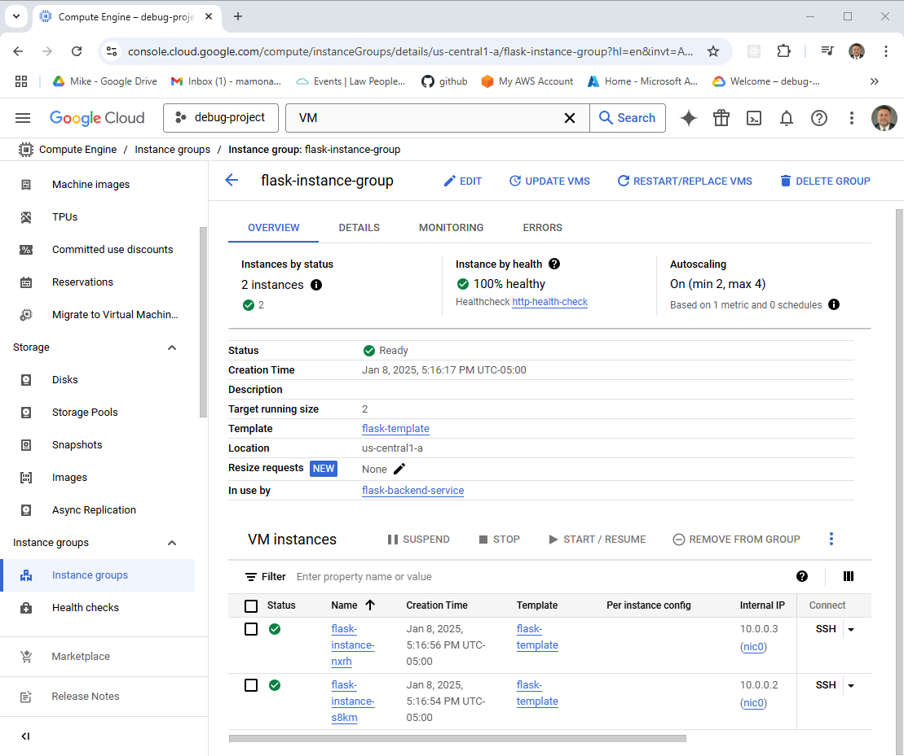
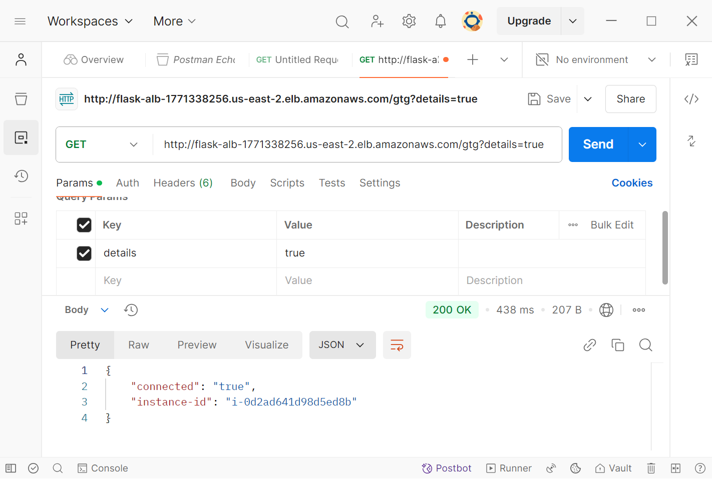

# GCP Managed Instance Group (MIG) Example

This is Part 3 of the Series: [Scaling in the Cloud: AWS Auto Scaling, Azure VMSS, and GCP MIGs](https://youtu.be/i_T7Wu_mJ1k).

## Introduction

In this video, we will demonstrate the deployment of Flask-based microservices within a **GCP Managed Instance Group (MIG)** while covering the following tasks:

- **Deploy Flask-based microservices** on GCP VMs.
- **Utilize Firestore** as a document database to store microservice data.
- **Create a VM image** of the deployed services using Packer.
- **Configure the Managed Instance Group** to enable automatic scalability using `Terraform`.
- **Simulate load** to test scalability and trigger scaling events.
- **Clean up resources** by decommissioning all infrastructure provisioned during the process.


## Prerequisites

* [A Google Cloud Account](https://console.cloud.google.com/)
* [Install gcloud CLI](https://cloud.google.com/sdk/docs/install) 
* [Install Latest Terraform](https://developer.hashicorp.com/terraform/install)
* [Install Latest Packer](https://developer.hashicorp.com/packer/install)

If this is your first time watching our content, we recommend starting with this video: [GCP + Terraform: Easy Setup](https://youtu.be/3spJpYX4f7I). It provides a step-by-step guide to properly configure Terraform, Packer, and the gcloud CLI.

## Download this Repository

```bash
git clone https://github.com/mamonaco1973/gcp-flask-mig.git
cd gcp-flask-mig
```

## Build the Code

Run [check_env](build\check_env.sh) then run [apply](apply.sh).

```bash
~/gcp-flask-mig$ ./apply.sh
NOTE: Validating that required commands are found in the PATH.
NOTE: gcloud is found in the current PATH.
NOTE: packer is found in the current PATH.
NOTE: terraform is found in the current PATH.
NOTE: All required commands are available.
NOTE: Validating credentials.json and test the gcloud command
Activated service account credentials for: [terraform-build@debug-project-446221.iam.gserviceaccount.com]
NOTE: Phase 1 Building Image with Packer
googlecompute.packer_build_image: output will be in this color.

==> googlecompute.packer_build_image: Checking image does not exist...
==> googlecompute.packer_build_image: Creating temporary RSA SSH key for instance...
==> googlecompute.packer_build_image: no persistent disk to create
==> googlecompute.packer_build_image: Using image: ubuntu-2404-noble-amd64-v20241219
==> googlecompute.packer_build_image: Creating instance...
    googlecompute.packer_build_image: Loading zone: us-central1-a
    googlecompute.packer_build_image: Loading machine type: e2-micro
    googlecompute.packer_build_image: Requesting instance creation...
    googlecompute.packer_build_image: Waiting for creation operation to complete...
    googlecompute.packer_build_image: Instance has been created!
==> googlecompute.packer_build_image: Waiting for the instance to become running...
    googlecompute.packer_build_image: IP: 34.57.89.191
==> googlecompute.packer_build_image: Using SSH communicator to connect: 34.57.89.191
==> googlecompute.packer_build_image: Waiting for SSH to become available...
[...]
```

## Build Process Overview

The build process is divided into two phases:

1. **Phase 1:** Build the Flask services into a VM image using Packer.
2. **Phase 2:** Create a simple network and set up the Managed Instance Group (MIG) using the image built in Phase 1. The scaling policies are also configured for the MIG.


## Tour of Build Output in the GCP Console



## Test the Services

We will test the services with [Postman](https://www.postman.com/downloads/). First run [validate.sh](validate.sh) to get the base URL for the build.

```bash
~/gcp-flask-mig$ ./validate.sh
NOTE: Health check endpoint is http://34.117.25.142/gtg?details=true
✓ good to go passed
✓ insert passed
✓ verification passed
✓ candidate list passed
azureuser@develop-vm:~/gcp-flask-mig$

```

Copy the value from validate `http://34.117.25.142/gtg?details=true` and paste into Postman.



### HTTP Endpoint Summary

#### `/gtg` (GET)
- **Purpose**: Health check.
- **Response**: 
  - `{"connected": "true", "instance-id": <instance_id>}` (if `details` query parameter is provided).
  - 200 OK with no body otherwise.

#### `/candidate/<name>` (GET)
- **Purpose**: Retrieve a candidate by name.
- **Response**: 
  - Candidate details (JSON) with status `200`.
  - `"Not Found"` with status `404` if no candidate is found.

#### `/candidate/<name>` (POST)
- **Purpose**: Add or update a candidate by name.
- **Response**: 
  - `{"CandidateName": <name>}` with status `200`.
  - `"Unable to update"` with status `500` on failure.

#### `/candidates` (GET)
- **Purpose**: Retrieve all candidates.
- **Response**: 
  - List of candidates (JSON) with status `200`.
  - `"Not Found"` with status `404` if no candidates exist.

## Simulate Load

We will access the VM instances and execute the `stress` command to simulate a high CPU load. This process will demonstrate the system's ability to dynamically scale up by adding VM instances in response to increased CPU utilization and subsequently scale down by removing nodes as the load decreases

### How Scaling Works

#### 1. **Managed Instance Group (MIG):**
- The **Managed Instance Group** (`google_compute_instance_group_manager`) ensures that a group of identical VM instances is maintained.
- It uses an **Instance Template** to define the configuration for all instances (e.g., machine type, boot image, and network settings).
- The MIG initially starts with a **target size** of 2 instances and supports auto-healing based on a health check.

#### 2. **Health Check for Auto-Healing:**
- A **Health Check** (`google_compute_health_check`) is configured to monitor the `/gtg` endpoint on port `8000` of the instances.
- If an instance is deemed unhealthy (fails the health check), the MIG automatically replaces it with a new instance.

#### 3. **Autoscaler for Dynamic Scaling:**
- The **Autoscaler** (`google_compute_autoscaler`) dynamically adjusts the number of instances in the MIG based on CPU utilization.
- The scaling policies are defined as follows:
  - **Minimum number of instances:** 2
  - **Maximum number of instances:** 4
  - **Target CPU utilization:** 60%
- If the average CPU utilization across instances exceeds 60%, the Autoscaler adds more instances (up to the maximum of 4) to handle the increased load.
- If the CPU utilization falls below 60%, the Autoscaler reduces the number of instances (down to the minimum of 2) to save resources.

#### 4. **Cooldown Period:**
- A **cooldown period** of 60 seconds is set to prevent rapid scaling actions, allowing time for new instances to stabilize before further scaling decisions are made.

### Workflow of Scaling:

1. **Initial Deployment:**
   - Two instances are created in the MIG as per the defined target size.

2. **Scaling Up:**
   - When the average CPU utilization across instances exceeds 60%, additional instances are launched (up to 4).

3. **Scaling Down:**
   - When the average CPU utilization drops below 60%, instances are terminated (down to 2).

4. **Health Monitoring:**
   - Instances are continuously monitored using the health check. Unhealthy instances are automatically replaced.

This setup ensures that the application can handle varying loads efficiently while maintaining optimal resource usage and availability.

## Run the "destroy" script when you are done

```bash
~/gcp-flask-mig$ ./destroy.sh
NOTE: Destroying GCP Infrastucture
Updated property [core/project].
Initializing the backend...
Initializing provider plugins...
- Reusing previous version of hashicorp/google from the dependency lock file
- Using previously-installed hashicorp/google v6.15.0

Terraform has been successfully initialized!

You may now begin working with Terraform. Try running "terraform plan" to see
any changes that are required for your infrastructure. All Terraform commands
should now work.

If you ever set or change modules or backend configuration for Terraform,
rerun this command to reinitialize your working directory. If you forget, other
commands will detect it and remind you to do so if necessary.
google_compute_health_check.http_health_check: Refreshing state... [id=projects/debug-project-446221/global/healthChecks/http-health-check]
google_compute_global_address.lb_ip: Refreshing state... [id=projects/debug-project-446221/global/addresses/flask-lb-ip]
google_project_iam_member.flask_firestore_access: Refreshing state... [id=debug-project-446221/roles/datastore.user/serviceAccount:terraform-build@debug-project-446221.iam.gserviceaccount.com]
data.google_compute_image.flask_packer_image: Reading...
google_compute_network.flask_vpc: Refreshing state... [id=projects/debug-project-446221/global/networks/flask-vpc]
[...]
```